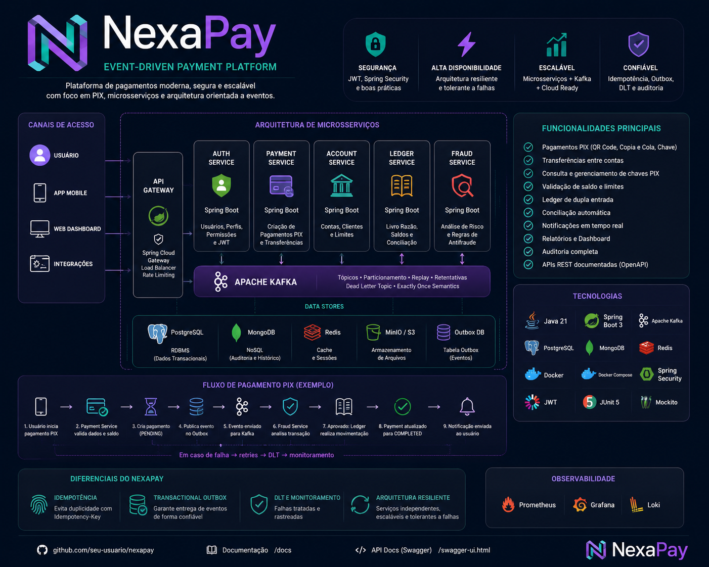

# NexaPay

<p align="center">
  
</p>

<p align="center">
  <strong>Event-Driven Payment Platform</strong>
</p>

<p align="center">
  Plataforma de pagamentos orientada a eventos desenvolvida com Java 21, Spring Boot, Apache Kafka, PostgreSQL, Flyway, Docker Compose e Transactional Outbox.
</p>

<p align="center">
  
  
  
  
  
  
</p>

---

## Sobre o projeto

O **NexaPay** é uma plataforma backend de pagamentos criada para demonstrar conceitos aplicados a sistemas financeiros distribuídos e orientados a eventos.

O projeto evolui de forma incremental por Sprints. Atualmente, as **Sprints 1 a 4 estão concluídas e incorporadas à `main`**, com quatro serviços Maven independentes:

- `payment-service` — criação e consulta de pagamentos PIX;
- `account-service` — contas, saldo, crédito e débito com controle transacional;
- `ledger-service` — histórico paginado de movimentações de conta consumidas via Kafka;
- `fraud-service` — análise assíncrona de risco para pagamentos.

A solução utiliza bancos PostgreSQL separados por serviço, comunicação assíncrona com Kafka e processamento orientado a eventos.

### Status atual

```text
Sprint 1 — Payment Service   ✅ Concluída
Sprint 2 — Account Service   ✅ Concluída
Sprint 3 — Ledger Service    ✅ Concluída
Sprint 4 — Fraud Service     ✅ Concluída
Sprint 5 — Segurança         ⏳ Próxima
```

---

## Arquitetura

<p align="center">
  
</p>

> O diagrama visual representa a direção arquitetural do projeto. Alguns componentes do roadmap, como autenticação, API Gateway, observabilidade completa e frontend, ainda serão implementados em Sprints futuras.

### Arquitetura atualmente implementada

```text
                              ┌────────────────────┐
                              │      Cliente       │
                              └─────────┬──────────┘
                                        │
                   ┌────────────────────┴────────────────────┐
                   │                                         │
                   v                                         v
        ┌──────────────────────┐                  ┌──────────────────────┐
        │   Payment Service    │                  │   Account Service    │
        │      :8081           │                  │      :8082           │
        └──────────┬───────────┘                  └──────────┬───────────┘
                   │                                         │
          ┌────────┴────────┐                       ┌────────┴────────┐
          │                 │                       │                 │
          v                 v                       v                 v
   PostgreSQL :5435   Transactional Outbox   PostgreSQL :5436   Transactional Outbox
                            │                                       │
                            v                                       v
                         Kafka                                   Kafka
                            │                                       │
              nexapay.payment.created.v1              ┌────────────┴────────────┐
                            │                          │                         │
                            v                          v                         v
                  ┌──────────────────┐     nexapay.account.credited.v1  nexapay.account.debited.v1
                  │  Fraud Service   │                          │
                  │      :8084       │                          v
                  └────────┬─────────┘                 ┌──────────────────┐
                           │                           │  Ledger Service   │
                           v                           │      :8083        │
                    PostgreSQL :5438                  └────────┬─────────┘
                                                              │
                                                              v
                                                       PostgreSQL :5437
```

### Semântica de entrega

O uso de Transactional Outbox garante que a alteração de domínio e o evento correspondente sejam persistidos de forma consistente no banco do serviço produtor.

A publicação no Kafka trabalha com semântica **at-least-once**. Por isso, os consumidores precisam ser preparados para reprocessamento e duplicidade de mensagens.

---

## Stack

### Backend

- Java 21
- Spring Boot 3.5.16
- Spring Web
- Spring Data JPA
- Hibernate
- Bean Validation
- Maven multi-module

### Banco de dados

- PostgreSQL 17
- Flyway
- JPA/Hibernate
- banco dedicado por serviço

### Mensageria

- Apache Kafka 3.9.1
- Kafka Producer e Consumer
- Event-Driven Architecture
- Transactional Outbox em serviços produtores
- processamento at-least-once

### Testes

- JUnit 5
- Mockito
- Spring Boot Test
- MockMvc
- Testcontainers

### Infraestrutura

- Docker
- Docker Compose
- Spring Boot Actuator

### Conceitos aplicados

- REST APIs
- arquitetura em camadas
- Service Layer
- Repository Pattern
- DTOs
- idempotência
- locking pessimista
- consistência transacional
- eventos assíncronos
- Transactional Outbox
- consumidores orientados a eventos
- paginação
- análise de risco baseada em regras

---

# Serviços

## 1. Payment Service — Sprint 1 ✅

Responsável pela criação e consulta de pagamentos PIX.

**Porta da aplicação:** `8081`  
**Banco:** `nexapay_payments`  
**PostgreSQL:** `localhost:5435`

### Endpoints

```http
POST /api/v1/payments/pix
GET  /api/v1/payments/{id}
```

Header obrigatório para criação:

```http
Idempotency-Key: pedido-001
```

Exemplo:

```json
{
  "payerAccountId": "ACC-1001",
  "pixKey": "cliente@email.com",
  "amount": 250.00,
  "description": "Pagamento NexaPay"
}
```

O Payment Service persiste o pagamento e um Outbox Event na mesma transação. Depois, o Outbox Publisher publica o evento:

```text
nexapay.payment.created.v1
```

Exemplo de contrato:

```json
{
  "eventId": "320df5c4-0299-4254-ac7f-a3e268f42b91",
  "paymentId": "7014a517-0738-4d49-9db4-9578ced44089",
  "payerAccountId": "ACC-1001",
  "pixKey": "cliente@email.com",
  "amount": 250.00,
  "occurredAt": "2026-08-13T21:57:51.521587Z"
}
```

---

## 2. Account Service — Sprint 2 ✅

Responsável por contas e operações de saldo.

**Porta da aplicação:** `8082`  
**Banco:** `nexapay_accounts`  
**PostgreSQL:** `localhost:5436`

### Endpoints

```http
POST /api/v1/accounts
GET  /api/v1/accounts/{id}
POST /api/v1/accounts/{id}/credit
POST /api/v1/accounts/{id}/debit
```

### Recursos implementados

- criação e consulta de contas;
- crédito e débito;
- valores monetários com `BigDecimal`;
- transações com Spring;
- locking pessimista (`PESSIMISTIC_WRITE`) nas operações que alteram saldo;
- Transactional Outbox;
- publicação de eventos de movimentação.

Tópicos produzidos:

```text
nexapay.account.credited.v1
nexapay.account.debited.v1
```

---

## 3. Ledger Service — Sprint 3 ✅

Responsável por consumir eventos financeiros do Account Service e manter o histórico de lançamentos da conta.

**Porta da aplicação:** `8083`  
**Banco:** `nexapay_ledger`  
**PostgreSQL:** `localhost:5437`  
**Kafka consumer group:** `nexapay-ledger-service`

### Eventos consumidos

```text
nexapay.account.credited.v1
nexapay.account.debited.v1
```

### Endpoint

```http
GET /api/v1/ledger/accounts/{accountId}
```

A consulta retorna um histórico paginado das movimentações associadas à conta.

### Recursos implementados

- Kafka Consumer;
- persistência de lançamentos de crédito e débito;
- proteção contra replay por `eventId`;
- histórico por conta;
- paginação via Spring Data.

---

## 4. Fraud Service — Sprint 4 ✅

Responsável por analisar de forma assíncrona pagamentos criados pelo Payment Service.

**Porta da aplicação:** `8084`  
**Banco:** `nexapay_fraud`  
**PostgreSQL:** `localhost:5438`  
**Kafka consumer group:** `nexapay-fraud-service`

### Evento consumido

```text
nexapay.payment.created.v1
```

### Motor de regras atual

```text
Valor < R$ 5.000                 → APPROVED | score 20
R$ 5.000 <= valor < R$ 10.000   → REVIEW   | score 70
Valor >= R$ 10.000              → BLOCKED  | score 95
```

> `BLOCKED`, `REVIEW` e `APPROVED` representam atualmente a **decisão da análise de fraude**. A Sprint 4 não altera automaticamente o status do Payment Service.

### Endpoint

```http
GET /api/v1/fraud/payments/{paymentId}
```

Exemplo de retorno:

```json
{
  "paymentId": "594c63c0-522a-46ec-bf94-f3f8e92759ba",
  "amount": 12000.00,
  "decision": "BLOCKED",
  "riskScore": 95,
  "reason": "Payment amount reached the high-risk threshold"
}
```

### Recursos implementados

- Kafka Consumer;
- regras determinísticas de risco;
- decisões `APPROVED`, `REVIEW` e `BLOCKED`;
- score de risco de 0 a 100;
- persistência com Flyway/PostgreSQL;
- proteção contra replay por `eventId`;
- API para consulta da decisão;
- testes de integração com Testcontainers e MockMvc.

---

# Estrutura do projeto

```text
nexapay-event-driven-payments
|
├── docs
│   └── images
│       ├── nexapay-logo.png
│       └── nexapay-architecture.png
│
├── payment-service
│   ├── src
│   │   ├── main
│   │   │   ├── java/br/com/nexapay/payment
│   │   │   │   ├── api
│   │   │   │   ├── domain
│   │   │   │   ├── event
│   │   │   │   ├── exception
│   │   │   │   ├── messaging
│   │   │   │   ├── repository
│   │   │   │   └── service
│   │   │   └── resources
│   │   │       ├── db/migration
│   │   │       └── application.yml
│   │   └── test
│   └── pom.xml
│
├── account-service
│   ├── src
│   │   ├── main
│   │   │   ├── java/br/com/nexapay/account
│   │   │   │   ├── api
│   │   │   │   ├── domain
│   │   │   │   ├── event
│   │   │   │   ├── exception
│   │   │   │   ├── messaging
│   │   │   │   ├── repository
│   │   │   │   └── service
│   │   │   └── resources
│   │   │       ├── db/migration
│   │   │       └── application.yml
│   │   └── test
│   └── pom.xml
│
├── ledger-service
│   ├── src
│   │   ├── main
│   │   │   ├── java/br/com/nexapay/ledger
│   │   │   │   ├── api
│   │   │   │   ├── domain
│   │   │   │   ├── event
│   │   │   │   ├── messaging
│   │   │   │   ├── repository
│   │   │   │   └── service
│   │   │   └── resources
│   │   │       ├── db/migration
│   │   │       └── application.yml
│   │   └── test
│   └── pom.xml
│
├── fraud-service
│   ├── src
│   │   ├── main
│   │   │   ├── java/br/com/nexapay/fraud
│   │   │   │   ├── api
│   │   │   │   ├── domain
│   │   │   │   ├── event
│   │   │   │   ├── messaging
│   │   │   │   ├── repository
│   │   │   │   └── service
│   │   │   └── resources
│   │   │       ├── db/migration
│   │   │       └── application.yml
│   │   └── test
│   └── pom.xml
│
├── scripts
│   ├── run-payment.ps1
│   ├── start-infra.ps1
│   ├── stop-infra.ps1
│   └── test-payment.ps1
│
├── docker-compose.yml
├── pom.xml
├── .gitignore
└── README.md
```

---

# Como executar

## Pré-requisitos

- Java 21
- Maven
- Docker Desktop
- Git

Verifique:

```powershell
java -version
mvn -version
docker --version
docker compose version
git --version
```

## 1. Clonar

```powershell
git clone https://github.com/juceliocoelho2022/nexapay-event-driven-payments.git
cd nexapay-event-driven-payments
```

## 2. Subir infraestrutura

```powershell
docker compose up -d
```

Serviços de infraestrutura esperados:

```text
Kafka                 localhost:9092
Payment PostgreSQL    localhost:5435
Account PostgreSQL    localhost:5436
Ledger PostgreSQL     localhost:5437
Fraud PostgreSQL      localhost:5438
```

## 3. Executar as aplicações

Abra terminais separados:

```powershell
mvn -pl payment-service spring-boot:run
```

```powershell
mvn -pl account-service spring-boot:run
```

```powershell
mvn -pl ledger-service spring-boot:run
```

```powershell
mvn -pl fraud-service spring-boot:run
```

Aplicações:

```text
Payment Service   http://localhost:8081
Account Service   http://localhost:8082
Ledger Service    http://localhost:8083
Fraud Service     http://localhost:8084
```

---

# Health checks

```powershell
curl.exe http://localhost:8081/actuator/health
curl.exe http://localhost:8082/actuator/health
curl.exe http://localhost:8083/actuator/health
curl.exe http://localhost:8084/actuator/health
```

Resultado esperado:

```json
{"status":"UP"}
```

---

# Testes

Executar todos os módulos:

```powershell
mvn clean test
```

O reactor Maven atual inclui:

```text
NexaPay
NexaPay Payment Service
NexaPay Account Service
NexaPay Ledger Service
NexaPay Fraud Service
```

A validação da Sprint 4 foi concluída com o reactor completo em `BUILD SUCCESS`. O Fraud Service possui cobertura de integração para regras de risco, replay do mesmo evento, consulta REST e resposta `404`.

Para executar somente um módulo:

```powershell
mvn -pl fraud-service clean test
```

---

# Observabilidade atual

Todos os serviços expõem Spring Boot Actuator:

```text
/actuator/health
/actuator/info
/actuator/metrics
```

Planejado para Sprint futura:

- Prometheus;
- Grafana;
- Loki;
- dashboards operacionais.

---

# Segurança

Autenticação e autorização **ainda não estão implementadas**.

A próxima etapa planejada é a **Sprint 5 — Segurança**, incluindo evolução para:

- Auth Service;
- Spring Security;
- JWT;
- roles;
- permissions.

---

# Roadmap

## Sprint 1 — Payment Service ✅

- [x] REST API de pagamentos PIX
- [x] PostgreSQL + Flyway
- [x] Idempotency-Key
- [x] Transactional Outbox
- [x] publicação em Kafka
- [x] testes automatizados
- [x] Actuator

## Sprint 2 — Account Service ✅

- [x] Account Service
- [x] criação e consulta de contas
- [x] saldo
- [x] crédito
- [x] débito
- [x] pessimistic locking
- [x] concorrência transacional
- [x] Transactional Outbox
- [x] eventos Kafka de crédito e débito
- [x] testes de integração

## Sprint 3 — Ledger Service ✅

- [x] Ledger Service
- [x] Kafka Consumer
- [x] consumo de eventos de crédito e débito
- [x] persistência de lançamentos
- [x] proteção contra replay por evento
- [x] histórico por conta
- [x] API paginada de extrato
- [x] testes de integração

## Sprint 4 — Fraud Service ✅

- [x] Fraud Service
- [x] Kafka Consumer de `PaymentCreatedEvent`
- [x] regras determinísticas de risco
- [x] `APPROVED`, `REVIEW` e `BLOCKED`
- [x] risk score
- [x] persistência PostgreSQL/Flyway
- [x] proteção contra replay por `eventId`
- [x] API de consulta da decisão
- [x] Testcontainers + MockMvc
- [x] validação E2E Payment → Outbox → Kafka → Fraud

## Sprint 5 — Segurança ⏳

- [ ] Auth Service
- [ ] Spring Security
- [ ] JWT
- [ ] Roles
- [ ] Permissions

## Sprint 6 — Resiliência

- [ ] Retry
- [ ] Dead Letter Topic
- [ ] estratégia de reprocessamento
- [ ] tratamento robusto de mensagens inválidas
- [ ] fortalecimento da idempotência concorrente

## Sprint 7 — Observabilidade

- [ ] Prometheus
- [ ] Grafana
- [ ] Loki
- [ ] métricas
- [ ] dashboards

## Sprint 8 — API Gateway

- [ ] Spring Cloud Gateway
- [ ] roteamento
- [ ] autenticação centralizada
- [ ] Rate Limiting

## Sprint 9 — Frontend

- [ ] React
- [ ] Dashboard
- [ ] pagamentos
- [ ] contas
- [ ] movimentações
- [ ] decisões de fraude

## Sprint 10 — CI/CD e Cloud

- [ ] GitHub Actions
- [ ] pipeline de build e testes
- [ ] empacotamento/deploy
- [ ] estratégia de cloud

---

## Limitações atuais conhecidas

- a decisão de fraude ainda não altera o status do pagamento;
- não há autenticação/autorização;
- não há API Gateway;
- retry/DLT ainda não foram implementados;
- a entrega Kafka é at-least-once e requer consumidores idempotentes;
- observabilidade avançada e CI/CD ainda fazem parte do roadmap.

---

## Autor

Projeto desenvolvido por **Jucelio Farias Coelho** como projeto de estudo e portfólio de engenharia de software backend Java.
