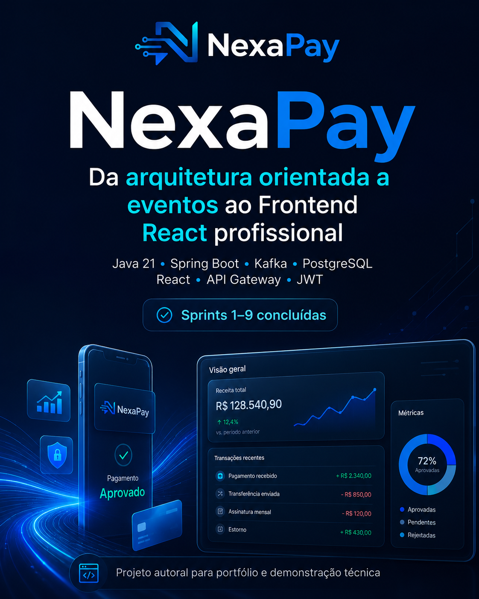
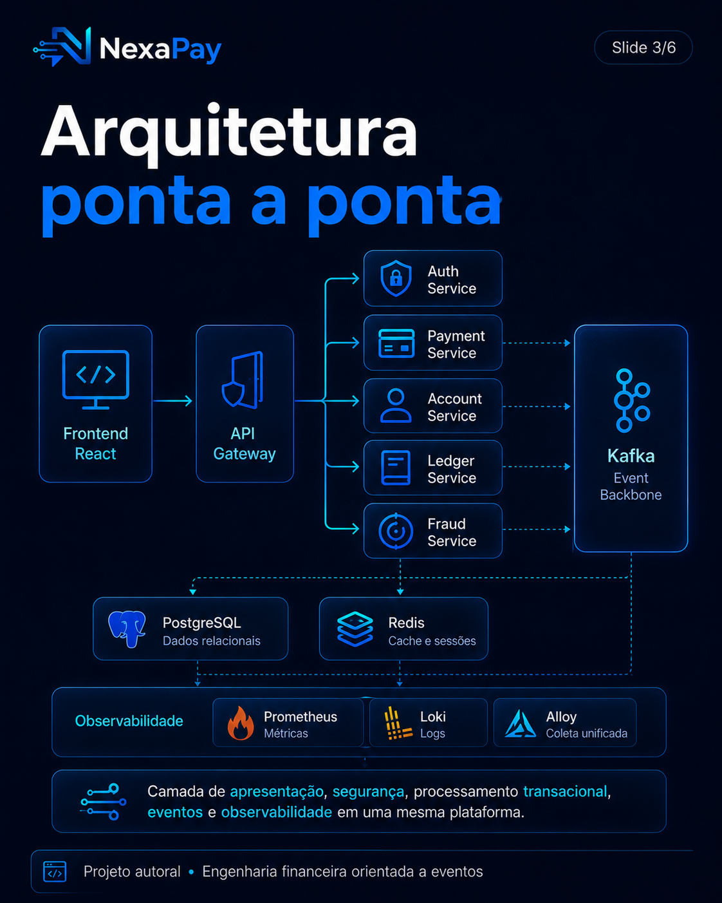
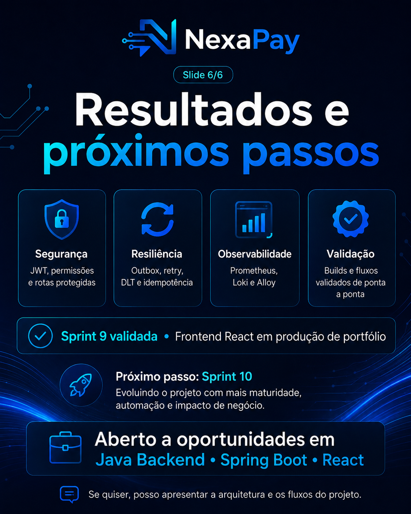
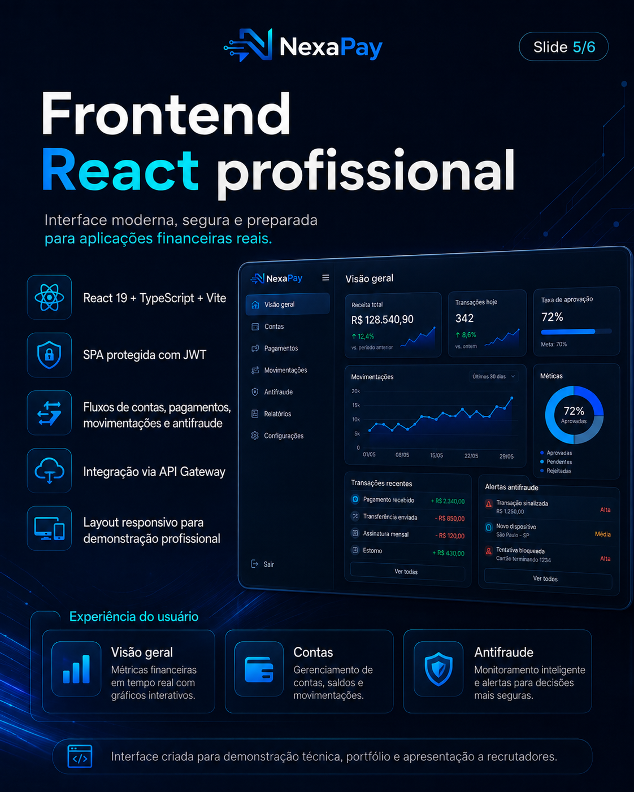
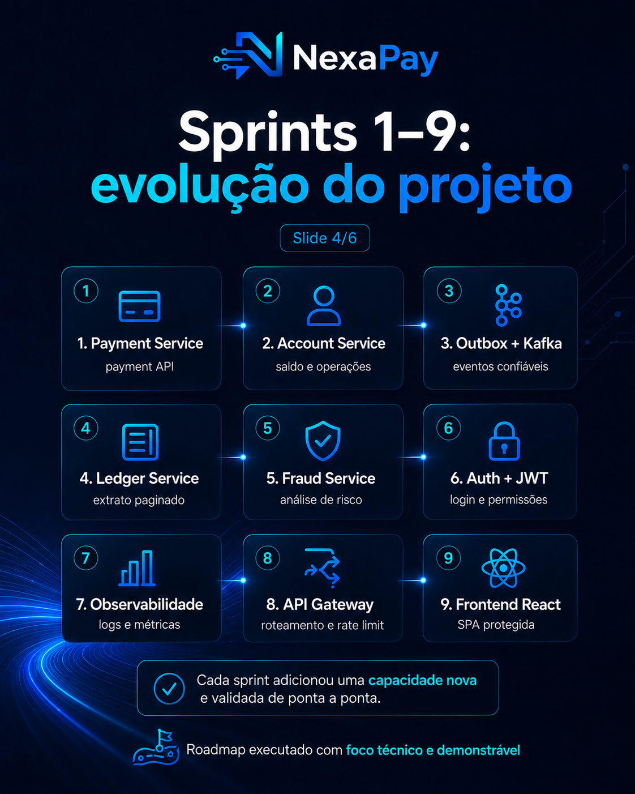
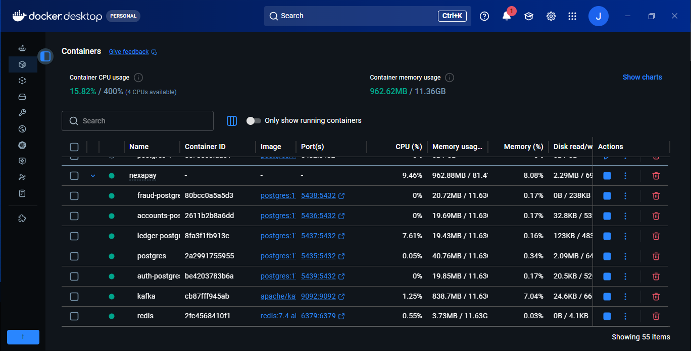

# NexaPay

<p align="center">
  
</p>

<p align="center">
  <strong>Event-Driven Payment Platform</strong>
</p>

<p align="center">
  Plataforma de pagamentos distribuída construída com Java 21, Spring Boot, Apache Kafka, PostgreSQL, Transactional Outbox, Spring Security e observabilidade com Prometheus, Grafana, Loki, Alloy, OpenTelemetry e Grafana Tempo.
</p>

<p align="center">
  
  
  
  
  
  
  
</p>

---


> **Engineering decisions & trade-offs:** [docs/engineering-decisions.md](docs/engineering-decisions.md) — contexto, alternativas consideradas, custos das escolhas, estratégia de testes e diagnóstico operacional.

> **AI-assisted engineering:** [AGENTS.md](AGENTS.md) · [PIX Payment SPEC](docs/specs/pix-payment-v1/README.md) · [ADR-005 SDD + AI](docs/adr/ADR-005-spec-driven-ai-assisted-development.md) · [AI workflows](.ai/workflows/feature-development.md)

### Engineering workflow: SDD + AI

O NexaPay usa IA como acelerador de engenharia, não como fonte de verdade. Mudanças relevantes seguem um fluxo verificável:

```text
Problem
  -> SPEC / acceptance criteria
  -> impact analysis + ADRs
  -> implementation
  -> automated tests
  -> review against SPEC
  -> CI / quality gates
  -> operational evidence
```

Guardrails para agentes, skills e workflows reutilizáveis são versionados junto com o código para manter contexto, invariantes e critérios de qualidade explícitos.

## Technical Snapshot

| Focus | Evidence in this project |
|---|---|
| Target roles | Java Backend Developer · Backend Engineer · Software Engineer |
| Architecture | Microservices · Event-Driven Architecture · Distributed Systems |
| Backend | Java 21 · Spring Boot · Spring Web · Spring Data JPA · Spring Security |
| Messaging & resilience | Apache Kafka · Transactional Outbox · Idempotency · Retry · DLT |
| Data | PostgreSQL · Redis · Flyway |
| Observability | OpenTelemetry · Prometheus · Grafana · Loki · Tempo |
| Quality & delivery | JUnit 5 · Mockito · MockMvc · Testcontainers · Docker · GitHub Actions |

**Engineering highlights:** fluxo PIX distribuído, processamento assíncrono, segurança JWT, semântica at-least-once com consumidores idempotentes, observabilidade ponta a ponta e tracing distribuído entre HTTP e Kafka.

**Keywords:** `Java Backend` `Spring Boot` `Microservices` `Apache Kafka` `REST API` `PostgreSQL` `Redis` `Docker` `CI/CD` `Distributed Systems` `Event-Driven Architecture` `Observability`

---


## Sobre o projeto

O **NexaPay** é um projeto de portfólio de engenharia de software backend Java voltado a sistemas financeiros distribuídos e orientados a eventos. A arquitetura explora comunicação síncrona e assíncrona, segurança, resiliência, CI/CD e os três pilares de observabilidade: **métricas, logs e traces**.

### Status

```text
Sprint 1  — Payment Service          ✅ Concluída
Sprint 2  — Account Service          ✅ Concluída
Sprint 3  — Ledger Service           ✅ Concluída
Sprint 4  — Fraud Service            ✅ Concluída
Sprint 5  — Segurança                ✅ Concluída
Sprint 6  — Resiliência              ✅ Concluída
Sprint 7  — Observabilidade          ✅ Concluída
Sprint 8  — API Gateway              ✅ Concluída
Sprint 9  — Frontend                 ✅ Concluída
Sprint 10 — CI/CD e Cloud            ✅ Concluída
Sprint 11 — Observabilidade avançada ✅ Concluída
Sprint 12 — Production Hardening     🚧 Em evolução
Sprint 13 — PIX Agendado             ✅ Concluída
Sprint 14 — PIX Recorrente           ✅ Concluída
Sprint 15 — Cancelamento e Auditoria ✅ Concluída
Sprint 16 — Fraud Decision State     ✅ Concluída
Sprint 17 — Manual Fraud Review       ✅ Concluída
Sprint 18 — Fraud Review Queue        🚧 Em evolução
```

---

## Galeria do projeto

### Visão geral
<p align="center"></p>

### Stack tecnológica
<p align="center"></p>

### Arquitetura e fluxo de eventos
<p align="center"></p>

### Evolução das sprints
<p align="center"></p>

### Frontend
<p align="center"></p>

### Ambiente integrado
<p align="center"></p>

### Containers Docker
<p align="center"></p>

---

## Arquitetura

```text
Cliente
  |
  v
API Gateway :8080
  |
  +-------------------+
  |                   |
  v                   v
Auth :8085        Payment :8081
                      |
                 PostgreSQL
                      |
              Transactional Outbox
                      |
                      v
                 Apache Kafka
                      |
                      v
                 Fraud :8084

Account :8082 ---> Kafka ---> Ledger :8083

Observabilidade
  Metrics -> Micrometer -> Prometheus -> Grafana
  Logs    -> Structured JSON -> Alloy -> Loki -> Grafana
  Traces  -> OpenTelemetry / OTLP -> Tempo -> Grafana
```

### Semântica de eventos

Os produtores usam **Transactional Outbox** para persistir alteração de domínio e evento na mesma transação local. A publicação e o consumo Kafka trabalham com semântica **at-least-once**; por isso, os consumidores são projetados para idempotência e reprocessamento. O projeto não reivindica exactly-once global.

---

## Stack

### Backend
- Java 21
- Spring Boot 3.5.16
- Spring Web
- Spring Data JPA / Hibernate
- Spring Security
- OAuth2 Resource Server JWT
- Maven

### Dados e mensageria
- PostgreSQL 17
- Flyway
- Apache Kafka 3.9.x
- Transactional Outbox
- Retry com Spring Kafka
- Dead Letter Topics

### Observabilidade
- Spring Boot Actuator
- Micrometer
- Prometheus
- Grafana
- Loki
- Grafana Alloy
- OpenTelemetry
- OTLP
- Grafana Tempo
- TraceQL
- logs estruturados em JSON
- correlationId ponta a ponta
- métricas JVM, HTTP, Outbox, Kafka e fraude

### Testes e infraestrutura
- JUnit 5
- Mockito
- Spring Boot Test
- Spring Security Test
- MockMvc
- Testcontainers
- Docker / Docker Compose
- GitHub Actions
- CI/CD e build de imagens Docker

---

## Serviços

| Serviço | Porta | Responsabilidade |
|---|---:|---|
| API Gateway | 8080 | entrada, roteamento e segurança |
| Payment Service | 8081 | criação e consulta de pagamentos PIX |
| Account Service | 8082 | contas, crédito, débito e saldo |
| Ledger Service | 8083 | histórico financeiro via eventos Kafka |
| Fraud Service | 8084 | análise assíncrona de risco |
| Auth Service | 8085 | autenticação, JWT, roles e permissions |

### Payment Service

```http
POST /api/v1/payments/pix
POST /api/v1/payments/pix/scheduled
POST /api/v1/payments/pix/recurring
POST /api/v1/payments/{id}/cancel
POST /api/v1/payments/pix/recurring/{id}/cancel

GET  /api/v1/payments/{id}
GET  /api/v1/payments/{id}/cancellations
GET  /api/v1/payments/pix/recurring/{id}/cancellations
POST /api/v1/payments/{id}/fraud-review
GET  /api/v1/payments/{id}/fraud-review/history
GET  /api/v1/fraud-review/cases
POST /api/v1/fraud-review/cases/{id}/claim
POST /api/v1/fraud-review/cases/{id}/release
```

A criação utiliza `Idempotency-Key`, Transactional Outbox e publica o evento:

```text
nexapay.payment.created.v1
```

### Account Service

```http
POST /api/v1/accounts
GET  /api/v1/accounts/{id}
POST /api/v1/accounts/{id}/credit
POST /api/v1/accounts/{id}/debit
```

Usa `BigDecimal`, transações, `PESSIMISTIC_WRITE` e publica eventos de crédito e débito via Outbox/Kafka.

### Ledger Service

Consome:

```text
nexapay.account.credited.v1
nexapay.account.debited.v1
```

Possui retry, DLT, replay protection e idempotência.

### Fraud Service

Consome:

```text
nexapay.payment.created.v1
```

```text
Valor < R$ 5.000                 -> APPROVED | score 20
R$ 5.000 <= valor < R$ 10.000   -> REVIEW   | score 70
Valor >= R$ 10.000              -> BLOCKED  | score 95
```

Possui retry/DLT, idempotência, métricas de fraude e tracing do consumer Kafka.

### Auth Service

```http
POST /api/v1/auth/register
POST /api/v1/auth/login
GET  /api/v1/auth/me
```

Implementa Spring Security, JWT, roles, permissions e Resource Server nos serviços protegidos.

---

# Sprint 11 — Observabilidade avançada ✅

A Sprint 11 consolidou métricas, logs estruturados, correlationId e SLOs técnicos.

- [x] correlationId ponta a ponta
- [x] propagação via Transactional Outbox e Kafka
- [x] fluxo Payment → Kafka → Fraud
- [x] logs estruturados em JSON
- [x] parsing com Grafana Alloy
- [x] structured metadata no Loki
- [x] dashboard NexaPay Distributed Logs
- [x] dashboard NexaPay Overview
- [x] dashboard NexaPay Resilience
- [x] dashboard NexaPay Technical SLOs
- [x] disponibilidade por serviço
- [x] HTTP 5xx Error Rate
- [x] latência HTTP
- [x] backlog do Outbox
- [x] métricas de retry e DLT Kafka

---

# Sprint 13 — PIX Agendado ✅

A Sprint 13 aplica o workflow **SPEC → arquitetura → implementação → testes → CI** em uma feature real.

- [SPEC Scheduled PIX v1](docs/specs/scheduled-pix-v1/README.md)
- [ADR-006 — claim atômico no PostgreSQL](docs/adr/ADR-006-scheduled-pix-atomic-claim.md)

Fluxo:

```text
POST /api/v1/payments/pix/scheduled
        |
        v
Payment status = SCHEDULED
        |
        | scheduledAt <= now
        v
atomic database claim
SCHEDULED -> PENDING
        |
        v
Transactional Outbox
        |
        v
Kafka: nexapay.payment.created.v1
        |
        v
Fraud Service
```

Destaques de engenharia:

- idempotência também no agendamento;
- `@Future` para impedir execução retroativa na criação;
- claim atômico para múltiplas instâncias do scheduler;
- nenhum evento é publicado antes do horário;
- Outbox é criada somente pelo vencedor do claim;
- métricas para agendamentos, execuções e claims ignorados;
- recorrência permanece fora deste primeiro slice e será evoluída separadamente.

---

# Sprint 14 — PIX Recorrente ✅

A Sprint 14 separa **regra de recorrência** de **execução financeira**.

- [SPEC Recurring PIX v1](docs/specs/recurring-pix-v1/README.md)
- [ADR-007 — materialização de pagamentos agendados](docs/adr/ADR-007-recurring-pix-materialization.md)

```text
Recurring Schedule
      |
      | DAILY / WEEKLY / MONTHLY
      v
atomic occurrence claim
      |
      v
Payment SCHEDULED
      |
      v
Sprint 13 execution pipeline
      |
      v
Transactional Outbox -> Kafka -> Fraud
```

Destaques:

- regra finita de 1 a 365 ocorrências;
- idempotência na criação da regra;
- chave determinística por ocorrência;
- claim concorrente no PostgreSQL;
- rastreabilidade entre schedule e pagamento;
- sem duplicação de lógica de Kafka/Outbox;
- calendário mensal preserva o dia âncora quando possível;
- Testcontainers valida concorrência e lifecycle em PostgreSQL real.

---

# Sprint 15 — Cancelamento e Auditoria ✅

A Sprint 15 adiciona **cancelamento concorrente, segregação de permissão e trilha imutável de auditoria**.

- [SPEC Cancellation v1](docs/specs/cancellation-v1/README.md)
- [ADR-008 — cancelamento por transição atômica](docs/adr/ADR-008-atomic-cancellation-state-transition.md)

```text
Payment SCHEDULED
      |
      +-- cancel claim -----> CANCELLED
      |
      +-- execution claim --> PENDING

Recurring ACTIVE
      |
      +-- cancel -----------> CANCELLED
      |                        |
      |                        +--> cancela payments ainda SCHEDULED
      |
      +-- materialize ------> Payment SCHEDULED
```

Destaques:

- nova authority `PAYMENT_CANCEL`;
- `SCHEDULED -> CANCELLED` por conditional update;
- `ACTIVE -> CANCELLED` para recorrências;
- cancelamento de pagamentos materializados ainda não executados;
- auditoria imutável com actor do JWT, motivo e instante;
- endpoints de histórico protegidos por `PAYMENT_READ`;
- métricas de sucesso, rejeição e pagamentos afetados;
- Testcontainers valida corrida real entre cancelamento e execução.

---

# Sprint 16 — Fraud Decision + Payment State Machine ✅

A Sprint 16 fecha o ciclo assíncrono entre Payment e Fraud sem dual write.

- [SPEC Fraud Decision State Machine v1](docs/specs/fraud-decision-state-machine-v1/README.md)
- [ADR-009 — Fraud Decision via Outbox](docs/adr/ADR-009-fraud-decision-outbox-state-machine.md)

```text
Payment PENDING
      |
      | PaymentCreated
      v
Kafka
      |
      v
Fraud Service
      |
      +-- FraudDecision
      +-- Transactional Outbox
      |
      | FraudDecisionMade
      v
Kafka
      |
      v
Payment Service
      |
      +-- APPROVED -> COMPLETED
      +-- REVIEW   -> REVIEW
      +-- BLOCKED  -> REJECTED
```

Destaques:

- Transactional Outbox também no Fraud Service;
- topic `nexapay.fraud.decision-made.v1`;
- deduplicação por `eventId` e `fraudDecisionId`;
- state transition somente a partir de `PENDING`;
- retry/DLT para eventos inválidos ou fora de estado;
- decisão, score, motivo e instante persistidos no pagamento;
- correlation/trace context preservado na Outbox;
- testes concorrentes com PostgreSQL 17/Testcontainers.

---

# Sprint 17 — Manual Fraud Review ✅

A Sprint 17 fecha o estado `REVIEW` com decisão humana segura e auditável.

- [SPEC Manual Fraud Review v1](docs/specs/manual-fraud-review-v1/README.md)
- [ADR-010 — revisão manual por transição atômica](docs/adr/ADR-010-manual-fraud-review-atomic-transition.md)

```text
Fraud Service
    |
    | REVIEW
    v
Payment REVIEW
    |
    +-- APPROVE --> COMPLETED
    |
    +-- REJECT ---> REJECTED
```

Destaques:

- authority dedicada `FRAUD_REVIEW`;
- bootstrap atual concede a permissão apenas a `ROLE_ADMIN`;
- `REVIEW -> COMPLETED/REJECTED` por conditional update;
- apenas uma revisão pode vencer em concorrência;
- auditoria imutável com reviewer, motivo, decisão e transição;
- histórico protegido por `PAYMENT_READ`;
- decisão automática original de fraude permanece preservada;
- Testcontainers valida disputa real APPROVE x REJECT no PostgreSQL 17.

---

# Sprint 18 — Fraud Review Queue 🚧

A Sprint 18 transforma pagamentos em `REVIEW` em **casos operacionais com ownership temporário**.

- [SPEC Fraud Review Queue v1](docs/specs/fraud-review-queue-v1/README.md)
- [ADR-011 — claim com lease no PostgreSQL](docs/adr/ADR-011-fraud-review-case-lease.md)

```text
FraudDecisionMade(REVIEW)
        |
        v
Payment REVIEW
        |
        +--> FraudReviewCase OPEN
                  |
                  | claim (lease 15 min)
                  v
              owned case
                  |
                  +-- APPROVE --> COMPLETED
                  +-- REJECT ---> REJECTED
                  +-- release/expiry --> available
```

Destaques:

- caso criado na mesma transação que coloca o pagamento em `REVIEW`;
- claim atômico no PostgreSQL;
- lease padrão de 15 minutos;
- mesmo analista pode renovar o lease;
- lease expirado pode ser assumido por outro analista;
- decisão manual exige ownership ativo;
- resolução do caso e decisão do pagamento compartilham a mesma transação;
- fila expõe amount, PIX key, risk score, reason e owner atual;
- Testcontainers valida disputa real entre analistas.

---

# Sprint 12 — Production Hardening e Distributed Tracing 🚧

## Production Hardening artifacts

- [Runbook, SLI/SLO targets and failure drills](docs/production-hardening.md)
- [Prometheus SLO recording/alert rules](observability/prometheus/slo-rules.yml)
- [Controlled failure-drill evidence script](scripts/failure-drill.ps1)
- [Controlled DLT replay](scripts/replay-dlt.ps1)

Current hardening status:

- [x] SLI/SLO targets versioned
- [x] bounded retry budget documented
- [x] Prometheus recording and alert rules
- [x] Prometheus rules validated by CI with `promtool`
- [x] PostgreSQL failure -> retry/DLT -> recovery/replay scenario
- [x] Kafka outage and downstream-service drill procedures
- [x] incident runbook
- [ ] runtime evidence package from the current environment (Grafana + Tempo + Loki + terminal output)

> The final evidence checkbox remains open intentionally until the drills are executed in the runtime environment and the resulting metrics/traces are reviewed.

A Sprint 12 evolui o NexaPay em direção a um ambiente mais próximo de produção, com foco em **distributed tracing**, diagnóstico de requisições e propagação de contexto através de comunicação síncrona e assíncrona.

## Distributed Tracing

O ambiente utiliza **Grafana Tempo** para armazenamento e consulta de traces distribuídos. A instrumentação permite acompanhar uma operação desde a entrada pelo API Gateway até o processamento assíncrono realizado pelo consumidor Kafka no Fraud Service.

### Fluxo validado

```text
Client
  |
  v
API Gateway
  | HTTP POST
  v
Payment Service
  |
  +-- POST /api/v1/payments/pix
  |
  +-- Transactional Outbox
  |
  +-- outbox publish PaymentCreated
  |
  +-- nexapay.payment.created.v1 send
          |
          v
       Apache Kafka
          |
          v
       Fraud Service
          |
          +-- nexapay.payment.created.v1 receive
```

### Evidência de tracing ponta a ponta

Foi validado no Grafana Tempo que uma operação PIX atravessa os seguintes componentes dentro da árvore de spans:

- [x] API Gateway
- [x] filtros Spring Security
- [x] Payment Service
- [x] `POST /api/v1/payments/pix`
- [x] autenticação Bearer Token
- [x] autorização do método
- [x] Transactional Outbox
- [x] `outbox publish PaymentCreated`
- [x] producer Kafka `nexapay.payment.created.v1 send`
- [x] propagação de contexto pelo Kafka
- [x] Fraud Service
- [x] consumer Kafka `nexapay.payment.created.v1 receive`

Exemplo conceitual da árvore observada:

```text
nexapay-gateway-service
└── http post
    └── nexapay-payment-service
        └── http post /api/v1/payments/pix
            ├── security filterchain
            ├── authenticate bearer token
            ├── secured request
            ├── authorize method
            ├── outbox publish PaymentCreated
            └── nexapay.payment.created.v1 send
                └── nexapay-fraud-service
                    └── nexapay.payment.created.v1 receive
```

A validação comprova propagação de contexto através de duas fronteiras diferentes:

```text
HTTP
Gateway -> Payment

Kafka
Payment -> Fraud
```

### Grafana Tempo e OTLP

```text
Grafana          localhost:3000
Tempo API        localhost:3200
OTLP gRPC        localhost:4317
OTLP HTTP        localhost:4318
```

O datasource `Tempo` permite explorar traces e executar consultas com **TraceQL**.

Exemplo por serviço:

```traceql
{ resource.service.name = "nexapay-gateway-service" }
```

Exemplo para localizar o consumer Kafka:

```traceql
{ name = "nexapay.payment.created.v1 receive" }
```

> Em uma busca por span filho, o resultado pode ser apresentado pelo span raiz do trace. O consumer Kafka pode então ser visualizado dentro da waterfall/árvore de spans do mesmo Trace ID.

### Três pilares de observabilidade

```text
Metrics
Services -> Micrometer -> Prometheus -> Grafana

Logs
Services -> Structured JSON -> Alloy -> Loki -> Grafana

Traces
Services -> OpenTelemetry / OTLP -> Tempo -> Grafana
```

Com essa evolução, o NexaPay permite correlacionar comportamento operacional, logs estruturados e execução distribuída entre microsserviços.

---

## Como executar

### Pré-requisitos

- Java 21
- Maven
- Docker Desktop
- Git

```powershell
docker compose up -d
```

### Infraestrutura local

```text
Kafka                 localhost:9092
Payment PostgreSQL    localhost:5435
Account PostgreSQL    localhost:5436
Ledger PostgreSQL     localhost:5437
Fraud PostgreSQL      localhost:5438
Auth PostgreSQL       localhost:5439
Prometheus            localhost:9090
Grafana               localhost:3000
Loki                  localhost:3100
Grafana Alloy         localhost:12345
Tempo API             localhost:3200
OTLP gRPC             localhost:4317
OTLP HTTP             localhost:4318
```

### Health checks

```powershell
Invoke-RestMethod http://localhost:8080/actuator/health
Invoke-RestMethod http://localhost:8084/actuator/health
Invoke-RestMethod http://localhost:8085/actuator/health
```

Resultado esperado:

```text
status
------
UP
```

---

## Testes

```powershell
mvn clean test
```

Validação de resiliência:

```powershell
powershell -ExecutionPolicy Bypass -File .\scripts\test-sprint6-resilience.ps1
```

Validação de observabilidade:

```powershell
powershell -ExecutionPolicy Bypass -File .\scripts\test-sprint7-observability.ps1
```

---

## Limitações conhecidas

- JWT usa HS256 com segredo compartilhado no ambiente atual;
- não há refresh token, revogação, password reset ou MFA;
- não há object-level authorization/ownership de conta ou pagamento;
- Kafka e Outbox operam com semântica at-least-once;
- DLT e offset commit não participam de uma única transação distribuída;
- replay de DLT é operacional e controlado;
- o Ledger não é double-entry;
- credenciais e segredos locais devem ser endurecidos antes de produção;
- hardening de produção e deploy cloud real continuam como evoluções da Sprint 12.

---

## Autor

Projeto desenvolvido por **Jucelio Farias Coelho** como projeto de estudo e portfólio de engenharia de software backend Java, microsserviços, sistemas orientados a eventos, segurança, resiliência, CI/CD e observabilidade distribuída.
