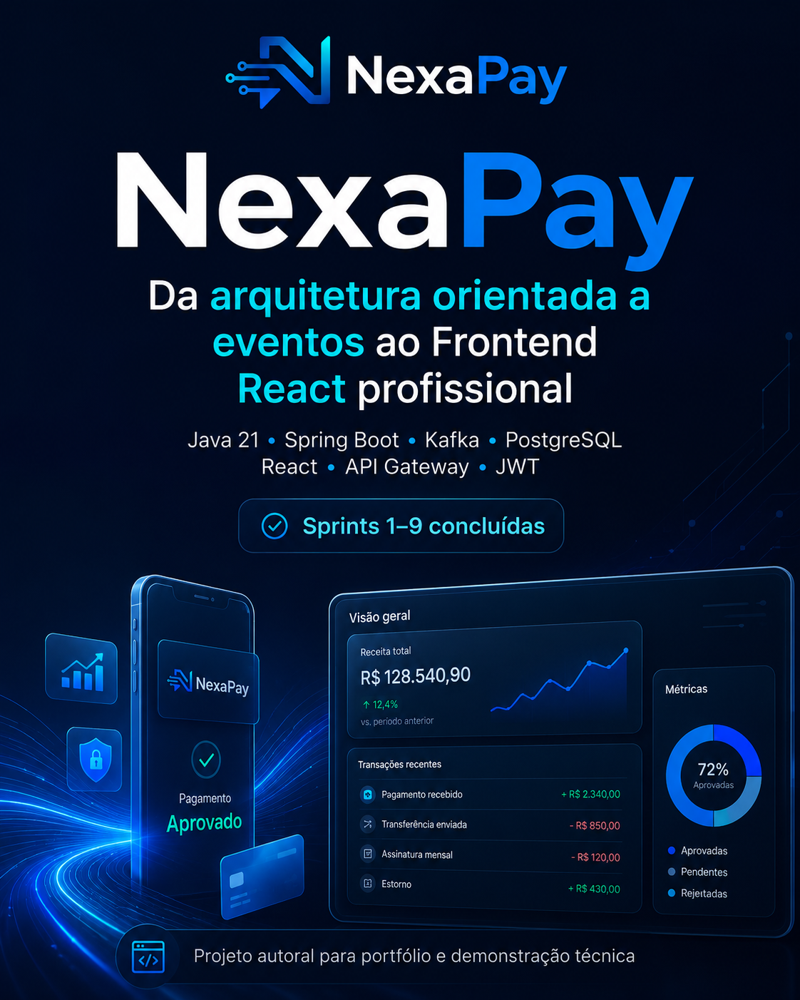
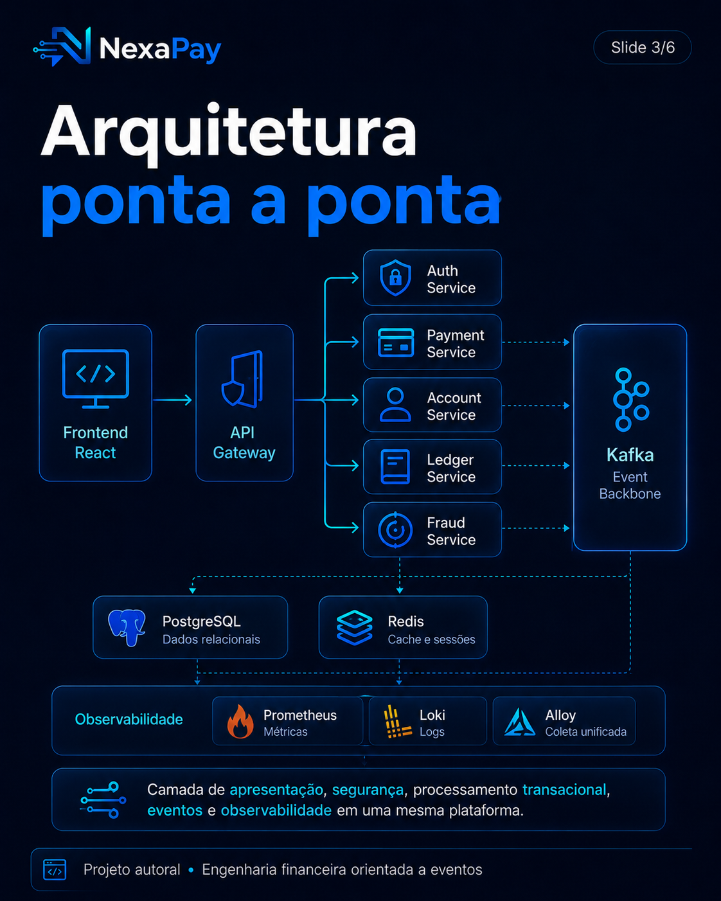
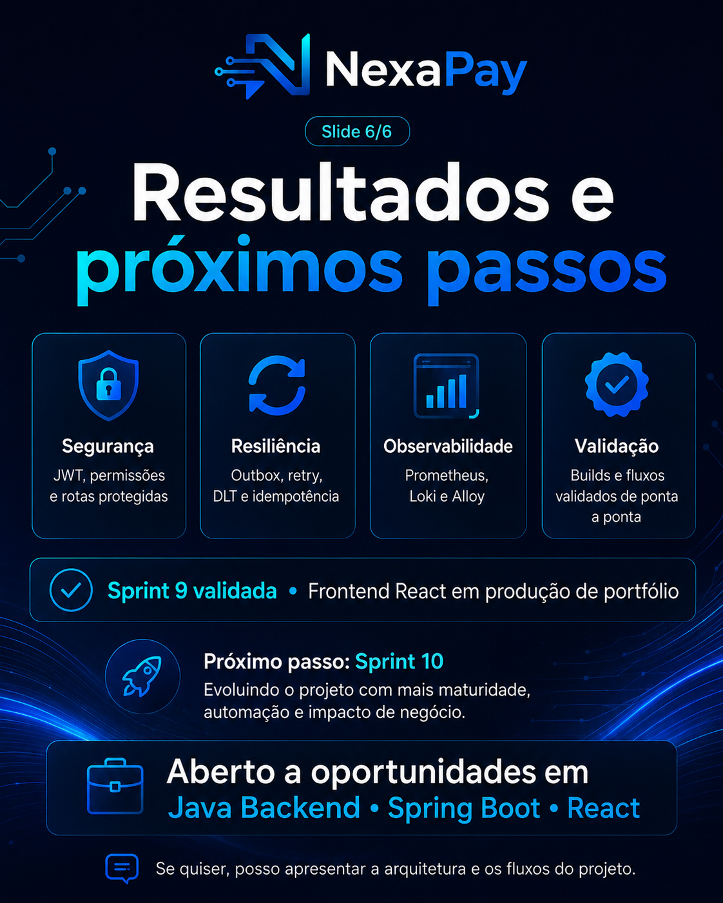
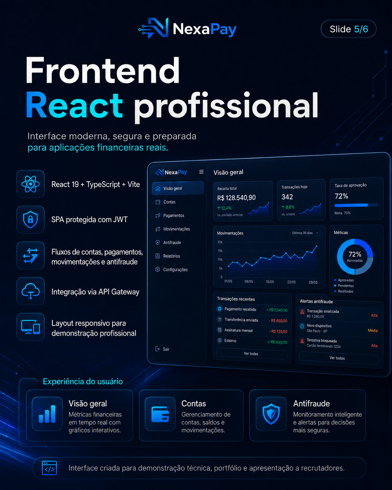
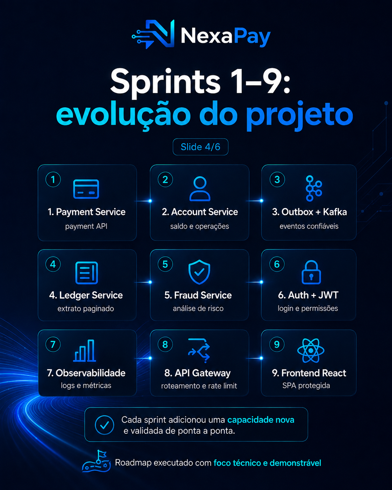
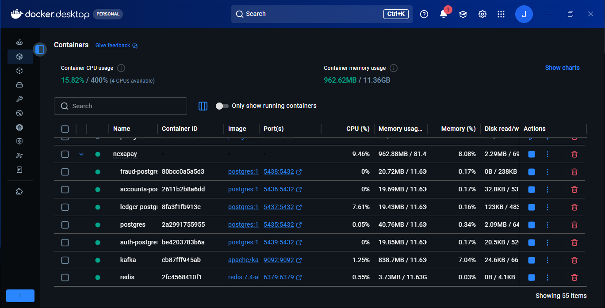

# NexaPay

<p align="center">
  
</p>

<p align="center">
  <strong>Distributed Payment Engineering Case</strong>
</p>

<p align="center">
  O NexaPay modela um sistema de pagamentos distribuído que precisa preservar invariantes financeiras diante de retries, redelivery, concorrência e falhas parciais.
</p>

<p align="center">
  
  
  
  
  
  
  
</p>

---

## Business Problem

Pagamentos digitais não podem assumir que uma requisição chegará uma única vez ou que todas as dependências estarão disponíveis ao mesmo tempo. Um cliente pode repetir um PIX depois de um timeout sem saber se a operação anterior foi aceita; um broker pode redeliverar eventos; duas threads podem disputar o mesmo saldo; banco e Kafka podem falhar em momentos diferentes.

O problema central do NexaPay é, portanto:

> **Como preservar invariantes financeiras em um fluxo distribuído sujeito a retries, redelivery, concorrência e falhas parciais sem depender de uma garantia exactly-once global?**

O projeto é um case de portfólio. Ele demonstra comportamentos, decisões e evidências presentes no repositório; não reivindica throughput, disponibilidade, latência ou escala de produção sem medição específica.

➡️ [Business Case e regras do domínio](docs/business-case.md)

---

## Financial Invariants / Failure Modes

| Falha / risco | Impacto de negócio | Proteção usada no projeto |
|---|---|---|
| retry do cliente envia a mesma intenção | pagamento duplicado | `Idempotency-Key` |
| PostgreSQL confirma e publicação falha | estado financeiro sem evento correspondente | Transactional Outbox |
| Kafka reentrega mensagem | efeito financeiro/projeção duplicada | consumer idempotente + replay protection |
| dois débitos disputam o mesmo saldo | saldo inconsistente | transação + PostgreSQL locking |
| múltiplos schedulers veem o mesmo PIX | execução agendada duplicada | atomic claim `SCHEDULED -> PENDING` |
| cancelamento compete com execução | duas transições incompatíveis | conditional state transition |
| duas revisões humanas competem | decisão/auditoria inconsistente | transição atômica + ownership/lease |
| falha percorre HTTP + Kafka | diagnóstico difícil | correlationId + metrics + logs + traces |

As regras canônicas BR-001 a BR-010 e os requisitos FR/NFR estão em [docs/business-case.md](docs/business-case.md), incluindo a matriz regra → requisito → componente → SPEC/ADR → evidência.

---

## Critical Payment Flow

```text
Client
  ↓
API Gateway
  ↓
Payment Service
  ├── authentication / authorization
  ├── validation
  └── Idempotency-Key
  ↓
PostgreSQL transaction
  ├── payment state
  └── outbox_event
  ↓
Outbox Publisher
  ↓
Kafka: nexapay.payment.created.v1
  ↓
Fraud Service
  ├── APPROVED
  ├── REVIEW
  └── BLOCKED
  ↓ Transactional Outbox
Kafka: nexapay.fraud.decision-made.v1
  ↓
Payment Service
  ├── APPROVED -> COMPLETED
  ├── REVIEW   -> REVIEW
  └── BLOCKED  -> REJECTED
```

### Semântica de entrega

O NexaPay trabalha com semântica compatível com **at-least-once** nas fronteiras assíncronas. Isso significa que publicação e consumo podem ser repetidos em limites de falha; por isso, idempotência é parte do desenho tanto na entrada HTTP quanto nos consumidores.

O projeto **não reivindica exactly-once global** entre PostgreSQL, publisher, Kafka e todos os consumidores.

---

## Engineering Decisions & Trade-offs

### PostgreSQL — fonte transacional e árbitro de concorrência

**Problema resolvido:** preservar saldo e transições críticas quando múltiplas operações competem pelo mesmo estado.

O projeto usa transações, `PESSIMISTIC_WRITE` no fluxo de conta quando aplicável, claims atômicos e conditional updates em fluxos como agendamento, cancelamento e revisão de fraude.

**Trade-off:** locking e conditional updates podem gerar contenção; exigem índices, transações curtas e testes de concorrência com banco real.

### Transactional Outbox — dual write

**Problema resolvido:** evitar depender de duas operações independentes — commit no PostgreSQL e publish no Kafka — como se fossem uma transação única.

Estado de domínio e intenção de publicação são persistidos na mesma transação local. O publisher envia o evento depois do commit.

**Trade-off:** adiciona tabela/estado de Outbox, publisher, retry, backlog e necessidade de monitoramento.

### Kafka — desacoplamento assíncrono

**Problema resolvido:** Payment, Ledger e Fraud não precisam executar todos de forma síncrona na mesma requisição.

Kafka permite consumers independentes, retenção/replay e integração com os fluxos event-driven do projeto.

**Trade-off:** aumenta complexidade operacional e não elimina redelivery; consumidores precisam ser idempotentes.

### Retry + DLT — falhas transitórias e isolamento

**Problema resolvido:** uma indisponibilidade temporária não deve ser tratada como falha definitiva, mas um erro permanente também não deve entrar em retry infinito.

**Trade-off:** políticas ruins de retry podem aumentar atraso, pressão downstream ou esconder a causa raiz. Replay deve ser controlado e idempotente.

### JWT + authorities — segregação de operações sensíveis

**Problema resolvido:** conhecer um endpoint não deve ser suficiente para cancelar pagamentos ou revisar fraude.

O projeto usa Spring Security, JWT, roles e authorities como `PAYMENT_CANCEL`, `PAYMENT_READ` e `FRAUD_REVIEW` de acordo com o fluxo.

**Trade-off:** autorização distribuída exige configuração e testes consistentes entre serviços.

### Observability — reconstrução do caminho da operação

**Problema resolvido:** uma falha pode atravessar API Gateway, Payment Service, Outbox, Kafka e Fraud Service.

Micrometer/Prometheus/Grafana, logs estruturados via Alloy/Loki e OpenTelemetry/Tempo permitem correlacionar sinais e investigar o fluxo.

**Trade-off:** telemetria tem custo de instrumentação, armazenamento e operação; os sinais precisam responder perguntas operacionais concretas.

➡️ [Engineering Decisions completas](docs/engineering-decisions.md)

---

## Evidence / Tests / Observability

A evidência do projeto é orientada ao risco que está sendo protegido:

- JUnit 5, Mockito e MockMvc para regras e contratos HTTP;
- Spring Security Test para autorização;
- Testcontainers/PostgreSQL para concorrência e transições dependentes do banco real;
- testes de idempotência, retry, DLT e replay conforme o fluxo;
- CI com GitHub Actions;
- métricas de HTTP, JVM, Outbox, Kafka e fraude;
- logs estruturados em JSON com correlationId;
- distributed tracing entre HTTP e Kafka usando OpenTelemetry/Tempo;
- SPECs e ADRs versionados com as decisões.

### Evidência de tracing já documentada

O repositório registra um fluxo observado no Tempo passando por:

```text
API Gateway
  ↓ HTTP
Payment Service
  ↓ Transactional Outbox
Kafka producer
  ↓
Fraud Service consumer
```

### Limite importante de evidência

A Sprint 12 possui runbook, SLI/SLO targets, regras Prometheus e procedimentos de failure drill, mas o próprio repositório mantém o **pacote final de runtime evidence** como pendente. Ele não é tratado aqui como concluído.

A Sprint 19 também permanece **em evolução** enquanto esse for o status registrado no README.

➡️ [Portfolio Case Study — roteiro para entrevistas](docs/PORTFOLIO_CASE_STUDY.md)

---

## Engineering workflow: SDD + AI

O NexaPay usa IA como acelerador de engenharia, não como fonte de verdade. Mudanças relevantes seguem um fluxo verificável:

```text
Problem
  -> SPEC / acceptance criteria
  -> impact analysis + ADRs
  -> implementation
  -> automated tests
  -> review against SPEC
  -> CI / quality gates
  -> operational evidence
```

Guardrails para agentes, skills e workflows reutilizáveis são versionados junto com o código para manter contexto, invariantes e critérios de qualidade explícitos.

**Referências:** [AGENTS.md](AGENTS.md) · [PIX Payment SPEC](docs/specs/pix-payment-v1/README.md) · [ADR-005 SDD + AI](docs/adr/ADR-005-spec-driven-ai-assisted-development.md) · [AI workflows](.ai/workflows/feature-development.md)

---

## Arquitetura

```text
Cliente
  |
  v
API Gateway :8080
  |
  +-------------------+
  |                   |
  v                   v
Auth :8085        Payment :8081
                      |
                 PostgreSQL
                      |
              Transactional Outbox
                      |
                      v
                 Apache Kafka
                      |
                      v
                 Fraud :8084

Account :8082 ---> Kafka ---> Ledger :8083

Observabilidade
  Metrics -> Micrometer -> Prometheus -> Grafana
  Logs    -> Structured JSON -> Alloy -> Loki -> Grafana
  Traces  -> OpenTelemetry / OTLP -> Tempo -> Grafana
```

---

## Technical Snapshot / Stack

| Focus | Evidence in this project |
|---|---|
| Target roles | Java Backend Developer · Backend Engineer · Software Engineer |
| Architecture | Microservices · Event-Driven Architecture · Distributed Systems |
| Backend | Java 21 · Spring Boot 3.5.16 · Spring Web · Spring Data JPA · Spring Security |
| Messaging & resilience | Apache Kafka 3.9.x · Transactional Outbox · Idempotency · Retry · DLT |
| Data | PostgreSQL 17 · Redis · Flyway |
| Observability | OpenTelemetry · Prometheus · Grafana · Loki · Tempo |
| Quality & delivery | JUnit 5 · Mockito · MockMvc · Testcontainers · Docker · GitHub Actions |

**Engineering highlights:** fluxo PIX distribuído, processamento assíncrono, segurança JWT, `at-least-once` com consumidores idempotentes, concorrência via PostgreSQL e observabilidade ponta a ponta.

**Keywords:** `Java Backend` `Spring Boot` `Microservices` `Apache Kafka` `REST API` `PostgreSQL` `Redis` `Docker` `CI/CD` `Distributed Systems` `Event-Driven Architecture` `Observability`

### Backend

- Java 21
- Spring Boot 3.5.16
- Spring Web
- Spring Data JPA / Hibernate
- Spring Security
- OAuth2 Resource Server JWT
- Maven

### Dados e mensageria

- PostgreSQL 17
- Flyway
- Apache Kafka 3.9.x
- Transactional Outbox
- Retry com Spring Kafka
- Dead Letter Topics

### Observabilidade

- Spring Boot Actuator
- Micrometer
- Prometheus
- Grafana
- Loki
- Grafana Alloy
- OpenTelemetry
- OTLP
- Grafana Tempo
- TraceQL
- logs estruturados em JSON
- correlationId ponta a ponta
- métricas JVM, HTTP, Outbox, Kafka e fraude

### Testes e infraestrutura

- JUnit 5
- Mockito
- Spring Boot Test
- Spring Security Test
- MockMvc
- Testcontainers
- Docker / Docker Compose
- GitHub Actions
- CI/CD e build de imagens Docker

---

## Sobre o projeto

O **NexaPay** é um projeto de portfólio de engenharia de software backend Java voltado a sistemas financeiros distribuídos e orientados a eventos. A arquitetura explora comunicação síncrona e assíncrona, segurança, resiliência, concorrência, CI/CD e os três pilares de observabilidade: **métricas, logs e traces**.

### Status

```text
Sprint 1  — Payment Service          ✅ Concluída
Sprint 2  — Account Service          ✅ Concluída
Sprint 3  — Ledger Service           ✅ Concluída
Sprint 4  — Fraud Service            ✅ Concluída
Sprint 5  — Segurança                ✅ Concluída
Sprint 6  — Resiliência              ✅ Concluída
Sprint 7  — Observabilidade          ✅ Concluída
Sprint 8  — API Gateway              ✅ Concluída
Sprint 9  — Frontend                 ✅ Concluída
Sprint 10 — CI/CD e Cloud            ✅ Concluída
Sprint 11 — Observabilidade avançada ✅ Concluída
Sprint 12 — Production Hardening     🚧 Em evolução
Sprint 13 — PIX Agendado             ✅ Concluída
Sprint 14 — PIX Recorrente           ✅ Concluída
Sprint 15 — Cancelamento e Auditoria ✅ Concluída
Sprint 16 — Fraud Decision State     ✅ Concluída
Sprint 17 — Manual Fraud Review      ✅ Concluída
Sprint 18 — Fraud Review Queue       ✅ Concluída
Sprint 19 — Fraud Review SLA         🚧 Em evolução
```

---

## Galeria do projeto

### Visão geral
<p align="center"></p>

### Stack tecnológica
<p align="center"></p>

### Arquitetura e fluxo de eventos
<p align="center"></p>

### Evolução das sprints
<p align="center"></p>

### Frontend
<p align="center"></p>

### Ambiente integrado
<p align="center"></p>

### Containers Docker
<p align="center"></p>

---

## Serviços

| Serviço | Porta | Responsabilidade |
|---|---:|---|
| API Gateway | 8080 | entrada, roteamento e segurança |
| Payment Service | 8081 | criação e consulta de pagamentos PIX |
| Account Service | 8082 | contas, crédito, débito e saldo |
| Ledger Service | 8083 | histórico financeiro via eventos Kafka |
| Fraud Service | 8084 | análise assíncrona de risco |
| Auth Service | 8085 | autenticação, JWT, roles e permissions |

### Payment Service

```http
POST /api/v1/payments/pix
POST /api/v1/payments/pix/scheduled
POST /api/v1/payments/pix/recurring
POST /api/v1/payments/{id}/cancel
POST /api/v1/payments/pix/recurring/{id}/cancel

GET  /api/v1/payments/{id}
GET  /api/v1/payments/{id}/cancellations
GET  /api/v1/payments/pix/recurring/{id}/cancellations
POST /api/v1/payments/{id}/fraud-review
GET  /api/v1/payments/{id}/fraud-review/history
GET  /api/v1/fraud-review/cases?priority=P1&overdue=false&available=true
POST /api/v1/fraud-review/cases/{id}/claim
POST /api/v1/fraud-review/cases/{id}/release
```

A criação utiliza `Idempotency-Key`, Transactional Outbox e publica o evento:

```text
nexapay.payment.created.v1
```

### Account Service

```http
POST /api/v1/accounts
GET  /api/v1/accounts/{id}
POST /api/v1/accounts/{id}/credit
POST /api/v1/accounts/{id}/debit
```

Usa `BigDecimal`, transações, `PESSIMISTIC_WRITE` e publica eventos de crédito e débito via Outbox/Kafka.

### Ledger Service

Consome:

```text
nexapay.account.credited.v1
nexapay.account.debited.v1
```

Possui retry, DLT, replay protection e idempotência.

### Fraud Service

Consome:

```text
nexapay.payment.created.v1
```

```text
Valor < R$ 5.000                 -> APPROVED | score 20
R$ 5.000 <= valor < R$ 10.000   -> REVIEW   | score 70
Valor >= R$ 10.000              -> BLOCKED  | score 95
```

Possui retry/DLT, idempotência, métricas de fraude e tracing do consumer Kafka.

### Auth Service

```http
POST /api/v1/auth/register
POST /api/v1/auth/login
GET  /api/v1/auth/me
```

Implementa Spring Security, JWT, roles, permissions e Resource Server nos serviços protegidos.

---

# Sprint 11 — Observabilidade avançada ✅

A Sprint 11 consolidou métricas, logs estruturados, correlationId e SLOs técnicos.

- [x] correlationId ponta a ponta
- [x] propagação via Transactional Outbox e Kafka
- [x] fluxo Payment → Kafka → Fraud
- [x] logs estruturados em JSON
- [x] parsing com Grafana Alloy
- [x] structured metadata no Loki
- [x] dashboard NexaPay Distributed Logs
- [x] dashboard NexaPay Overview
- [x] dashboard NexaPay Resilience
- [x] dashboard NexaPay Technical SLOs
- [x] disponibilidade por serviço
- [x] HTTP 5xx Error Rate
- [x] latência HTTP
- [x] backlog do Outbox
- [x] métricas de retry e DLT Kafka

---

# Sprint 13 — PIX Agendado ✅

A Sprint 13 aplica o workflow **SPEC → arquitetura → implementação → testes → CI** em uma feature real.

- [SPEC Scheduled PIX v1](docs/specs/scheduled-pix-v1/README.md)
- [ADR-006 — claim atômico no PostgreSQL](docs/adr/ADR-006-scheduled-pix-atomic-claim.md)

Fluxo:

```text
POST /api/v1/payments/pix/scheduled
        |
        v
Payment status = SCHEDULED
        |
        | scheduledAt <= now
        v
atomic database claim
SCHEDULED -> PENDING
        |
        v
Transactional Outbox
        |
        v
Kafka: nexapay.payment.created.v1
        |
        v
Fraud Service
```

Destaques de engenharia:

- idempotência também no agendamento;
- `@Future` para impedir execução retroativa na criação;
- claim atômico para múltiplas instâncias do scheduler;
- nenhum evento é publicado antes do horário;
- Outbox é criada somente pelo vencedor do claim;
- métricas para agendamentos, execuções e claims ignorados;
- recorrência permanece fora deste primeiro slice e será evoluída separadamente.

---

# Sprint 14 — PIX Recorrente ✅

A Sprint 14 separa **regra de recorrência** de **execução financeira**.

- [SPEC Recurring PIX v1](docs/specs/recurring-pix-v1/README.md)
- [ADR-007 — materialização de pagamentos agendados](docs/adr/ADR-007-recurring-pix-materialization.md)

```text
Recurring Schedule
      |
      | DAILY / WEEKLY / MONTHLY
      v
atomic occurrence claim
      |
      v
Payment SCHEDULED
      |
      v
Sprint 13 execution pipeline
      |
      v
Transactional Outbox -> Kafka -> Fraud
```

Destaques:

- regra finita de 1 a 365 ocorrências;
- idempotência na criação da regra;
- chave determinística por ocorrência;
- claim concorrente no PostgreSQL;
- rastreabilidade entre schedule e pagamento;
- sem duplicação de lógica de Kafka/Outbox;
- calendário mensal preserva o dia âncora quando possível;
- Testcontainers valida concorrência e lifecycle em PostgreSQL real.

---

# Sprint 15 — Cancelamento e Auditoria ✅

A Sprint 15 adiciona **cancelamento concorrente, segregação de permissão e trilha imutável de auditoria**.

- [SPEC Cancellation v1](docs/specs/cancellation-v1/README.md)
- [ADR-008 — cancelamento por transição atômica](docs/adr/ADR-008-atomic-cancellation-state-transition.md)

```text
Payment SCHEDULED
      |
      +-- cancel claim -----> CANCELLED
      |
      +-- execution claim --> PENDING

Recurring ACTIVE
      |
      +-- cancel -----------> CANCELLED
      |                        |
      |                        +--> cancela payments ainda SCHEDULED
      |
      +-- materialize ------> Payment SCHEDULED
```

Destaques:

- nova authority `PAYMENT_CANCEL`;
- `SCHEDULED -> CANCELLED` por conditional update;
- `ACTIVE -> CANCELLED` para recorrências;
- cancelamento de pagamentos materializados ainda não executados;
- auditoria imutável com actor do JWT, motivo e instante;
- endpoints de histórico protegidos por `PAYMENT_READ`;
- métricas de sucesso, rejeição e pagamentos afetados;
- Testcontainers valida corrida real entre cancelamento e execução.

---

# Sprint 16 — Fraud Decision + Payment State Machine ✅

A Sprint 16 fecha o ciclo assíncrono entre Payment e Fraud sem dual write.

- [SPEC Fraud Decision State Machine v1](docs/specs/fraud-decision-state-machine-v1/README.md)
- [ADR-009 — Fraud Decision via Outbox](docs/adr/ADR-009-fraud-decision-outbox-state-machine.md)

```text
Payment PENDING
      |
      | PaymentCreated
      v
Kafka
      |
      v
Fraud Service
      |
      +-- FraudDecision
      +-- Transactional Outbox
      |
      | FraudDecisionMade
      v
Kafka
      |
      v
Payment Service
      |
      +-- APPROVED -> COMPLETED
      +-- REVIEW   -> REVIEW
      +-- BLOCKED  -> REJECTED
```

Destaques:

- Transactional Outbox também no Fraud Service;
- topic `nexapay.fraud.decision-made.v1`;
- deduplicação por `eventId` e `fraudDecisionId`;
- state transition somente a partir de `PENDING`;
- retry/DLT para eventos inválidos ou fora de estado;
- decisão, score, motivo e instante persistidos no pagamento;
- correlation/trace context preservado na Outbox;
- testes concorrentes com PostgreSQL 17/Testcontainers.

---

# Sprint 17 — Manual Fraud Review ✅

A Sprint 17 fecha o estado `REVIEW` com decisão humana segura e auditável.

- [SPEC Manual Fraud Review v1](docs/specs/manual-fraud-review-v1/README.md)
- [ADR-010 — revisão manual por transição atômica](docs/adr/ADR-010-manual-fraud-review-atomic-transition.md)

```text
Fraud Service
    |
    | REVIEW
    v
Payment REVIEW
    |
    +-- APPROVE --> COMPLETED
    |
    +-- REJECT ---> REJECTED
```

Destaques:

- authority dedicada `FRAUD_REVIEW`;
- bootstrap atual concede a permissão apenas a `ROLE_ADMIN`;
- `REVIEW -> COMPLETED/REJECTED` por conditional update;
- apenas uma revisão pode vencer em concorrência;
- auditoria imutável com reviewer, motivo, decisão e transição;
- histórico protegido por `PAYMENT_READ`;
- decisão automática original de fraude permanece preservada;
- Testcontainers valida disputa real APPROVE x REJECT no PostgreSQL 17.

---

# Sprint 18 — Fraud Review Queue ✅

A Sprint 18 transforma pagamentos em `REVIEW` em **casos operacionais com ownership temporário**.

- [SPEC Fraud Review Queue v1](docs/specs/fraud-review-queue-v1/README.md)
- [ADR-011 — claim com lease no PostgreSQL](docs/adr/ADR-011-fraud-review-case-lease.md)

```text
FraudDecisionMade(REVIEW)
        |
        v
Payment REVIEW
        |
        +--> FraudReviewCase OPEN
                  |
                  | claim (lease 15 min)
                  v
              owned case
                  |
                  +-- APPROVE --> COMPLETED
                  +-- REJECT ---> REJECTED
                  +-- release/expiry --> available
```

Destaques:

- caso criado na mesma transação que coloca o pagamento em `REVIEW`;
- claim atômico no PostgreSQL;
- lease padrão de 15 minutos;
- mesmo analista pode renovar o lease;
- lease expirado pode ser assumido por outro analista;
- decisão manual exige ownership ativo;
- resolução do caso e decisão do pagamento compartilham a mesma transação;
- fila expõe amount, PIX key, risk score, reason e owner atual;
- Testcontainers valida disputa real entre analistas.

---

# Sprint 19 — Fraud Review SLA & Escalation 🚧

A Sprint 19 adiciona **priorização, deadline, escalonamento e observabilidade operacional** à Fraud Review Queue.

- [SPEC Fraud Review SLA v1](docs/specs/fraud-review-sla-v1/README.md)
- [ADR-012 — SLA com prioridade persistida](docs/adr/ADR-012-fraud-review-sla-priority-escalation.md)

```text
Fraud Review Case OPEN
        |
        +-- P1 -> 15 min
        +-- P2 -> 30 min
        +-- P3 -> 60 min
        |
        v
sla_due_at
        |
        +-- on time --> normal review
        |
        +-- overdue --> escalated_at + metrics + alert
```

Política inicial:

- **P1**: riskScore >= 85 ou amount >= R$ 9.000;
- **P2**: riskScore >= 80 ou amount >= R$ 7.500;
- **P3**: demais casos em revisão.

Destaques:

- prioridade e `sla_due_at` persistidos;
- migration com backfill para casos existentes;
- ordenação P1 → P2 → P3 e deadline mais próximo;
- filtros por prioridade, overdue e disponibilidade;
- monitor periódico marca casos vencidos como escalados;
- gauges Prometheus de backlog, overdue, P1 overdue e idade do caso mais antigo;
- alertas Prometheus para breach de SLA e backlog;
- dashboard Grafana `NexaPay Fraud Review Operations`;
- Testcontainers valida política, ordenação, filtros e escalonamento.

> **Status:** a Sprint 19 permanece em evolução; a existência desses artefatos não transforma o sprint em concluído enquanto o status do projeto continuar 🚧.

---

# Sprint 12 — Production Hardening e Distributed Tracing 🚧

## Production Hardening artifacts

- [Runbook, SLI/SLO targets and failure drills](docs/production-hardening.md)
- [Prometheus SLO recording/alert rules](observability/prometheus/slo-rules.yml)
- [Controlled failure-drill evidence script](scripts/failure-drill.ps1)
- [Controlled DLT replay](scripts/replay-dlt.ps1)

Current hardening status:

- [x] SLI/SLO targets versioned
- [x] bounded retry budget documented
- [x] Prometheus recording and alert rules
- [x] Prometheus rules validated by CI with `promtool`
- [x] PostgreSQL failure -> retry/DLT -> recovery/replay scenario
- [x] Kafka outage and downstream-service drill procedures
- [x] incident runbook
- [ ] runtime evidence package from the current environment (Grafana + Tempo + Loki + terminal output)

> The final evidence checkbox remains open intentionally until the drills are executed in the runtime environment and the resulting metrics/traces are reviewed.

A Sprint 12 evolui o NexaPay em direção a um ambiente mais próximo de produção, com foco em **distributed tracing**, diagnóstico de requisições e propagação de contexto através de comunicação síncrona e assíncrona.

## Distributed Tracing

O ambiente utiliza **Grafana Tempo** para armazenamento e consulta de traces distribuídos. A instrumentação permite acompanhar uma operação desde a entrada pelo API Gateway até o processamento assíncrono realizado pelo consumidor Kafka no Fraud Service.

### Fluxo validado

```text
Client
  |
  v
API Gateway
  | HTTP POST
  v
Payment Service
  |
  +-- POST /api/v1/payments/pix
  |
  +-- Transactional Outbox
  |
  +-- outbox publish PaymentCreated
  |
  +-- nexapay.payment.created.v1 send
          |
          v
       Apache Kafka
          |
          v
       Fraud Service
          |
          +-- nexapay.payment.created.v1 receive
```

### Evidência de tracing ponta a ponta

Foi validado no Grafana Tempo que uma operação PIX atravessa os seguintes componentes dentro da árvore de spans:

- [x] API Gateway
- [x] filtros Spring Security
- [x] Payment Service
- [x] `POST /api/v1/payments/pix`
- [x] autenticação Bearer Token
- [x] autorização do método
- [x] Transactional Outbox
- [x] `outbox publish PaymentCreated`
- [x] producer Kafka `nexapay.payment.created.v1 send`
- [x] propagação de contexto pelo Kafka
- [x] Fraud Service
- [x] consumer Kafka `nexapay.payment.created.v1 receive`

Exemplo conceitual da árvore observada:

```text
nexapay-gateway-service
└── http post
    └── nexapay-payment-service
        └── http post /api/v1/payments/pix
            ├── security filterchain
            ├── authenticate bearer token
            ├── secured request
            ├── authorize method
            ├── outbox publish PaymentCreated
            └── nexapay.payment.created.v1 send
                └── nexapay-fraud-service
                    └── nexapay.payment.created.v1 receive
```

A validação comprova propagação de contexto através de duas fronteiras diferentes:

```text
HTTP
Gateway -> Payment

Kafka
Payment -> Fraud
```

### Grafana Tempo e OTLP

```text
Grafana          localhost:3000
Tempo API        localhost:3200
OTLP gRPC        localhost:4317
OTLP HTTP        localhost:4318
```

O datasource `Tempo` permite explorar traces e executar consultas com **TraceQL**.

Exemplo por serviço:

```traceql
{ resource.service.name = "nexapay-gateway-service" }
```

Exemplo para localizar o consumer Kafka:

```traceql
{ name = "nexapay.payment.created.v1 receive" }
```

> Em uma busca por span filho, o resultado pode ser apresentado pelo span raiz do trace. O consumer Kafka pode então ser visualizado dentro da waterfall/árvore de spans do mesmo Trace ID.

### Três pilares de observabilidade

```text
Metrics
Services -> Micrometer -> Prometheus -> Grafana

Logs
Services -> Structured JSON -> Alloy -> Loki -> Grafana

Traces
Services -> OpenTelemetry / OTLP -> Tempo -> Grafana
```

Com essa evolução, o NexaPay permite correlacionar comportamento operacional, logs estruturados e execução distribuída entre microsserviços.

---

## Como executar

### Pré-requisitos

- Java 21
- Maven
- Docker Desktop
- Git

```powershell
docker compose up -d
```

### Infraestrutura local

```text
Kafka                 localhost:9092
Payment PostgreSQL    localhost:5435
Account PostgreSQL    localhost:5436
Ledger PostgreSQL     localhost:5437
Fraud PostgreSQL      localhost:5438
Auth PostgreSQL       localhost:5439
Prometheus            localhost:9090
Grafana               localhost:3000
Loki                  localhost:3100
Grafana Alloy         localhost:12345
Tempo API             localhost:3200
OTLP gRPC             localhost:4317
OTLP HTTP             localhost:4318
```

### Health checks

```powershell
Invoke-RestMethod http://localhost:8080/actuator/health
Invoke-RestMethod http://localhost:8084/actuator/health
Invoke-RestMethod http://localhost:8085/actuator/health
```

Resultado esperado:

```text
status
------
UP
```

---

## Testes

```powershell
mvn clean test
```

Validação de resiliência:

```powershell
powershell -ExecutionPolicy Bypass -File .\scripts\test-sprint6-resilience.ps1
```

Validação de observabilidade:

```powershell
powershell -ExecutionPolicy Bypass -File .\scripts\test-sprint7-observability.ps1
```

---

## Documentação principal

### Negócio e apresentação

- [Business Case e Domain Rules](docs/business-case.md)
- [Portfolio Case Study](docs/PORTFOLIO_CASE_STUDY.md)
- [Engineering Decisions](docs/engineering-decisions.md)

### Especificações e ADRs

- [PIX Payment SPEC](docs/specs/pix-payment-v1/README.md)
- [Scheduled PIX SPEC](docs/specs/scheduled-pix-v1/README.md)
- [Recurring PIX SPEC](docs/specs/recurring-pix-v1/README.md)
- [Cancellation SPEC](docs/specs/cancellation-v1/README.md)
- [Fraud Decision SPEC](docs/specs/fraud-decision-state-machine-v1/README.md)
- [Manual Fraud Review SPEC](docs/specs/manual-fraud-review-v1/README.md)
- [Fraud Review Queue SPEC](docs/specs/fraud-review-queue-v1/README.md)
- [Fraud Review SLA SPEC](docs/specs/fraud-review-sla-v1/README.md)
- [ADRs](docs/adr/)

### Operação

- [Distributed Observability](docs/SPRINT11-DISTRIBUTED-OBSERVABILITY.md)
- [Production Hardening](docs/production-hardening.md)

---

## Limitações conhecidas

- JWT usa HS256 com segredo compartilhado no ambiente atual;
- não há refresh token, revogação, password reset ou MFA;
- não há object-level authorization/ownership de conta ou pagamento;
- Kafka e Outbox operam com semântica at-least-once;
- DLT e offset commit não participam de uma única transação distribuída;
- replay de DLT é operacional e controlado;
- o Ledger não é double-entry;
- credenciais e segredos locais devem ser endurecidos antes de produção;
- hardening de produção e deploy cloud real continuam como evoluções da Sprint 12;
- o projeto não apresenta números formais de throughput/latência/disponibilidade como resultados de produção sem benchmark correspondente.

---

## Autor

Projeto desenvolvido por **Jucelio Farias Coelho** como projeto de estudo e portfólio de engenharia de software backend Java, microsserviços, sistemas orientados a eventos, segurança, resiliência, CI/CD e observabilidade distribuída.